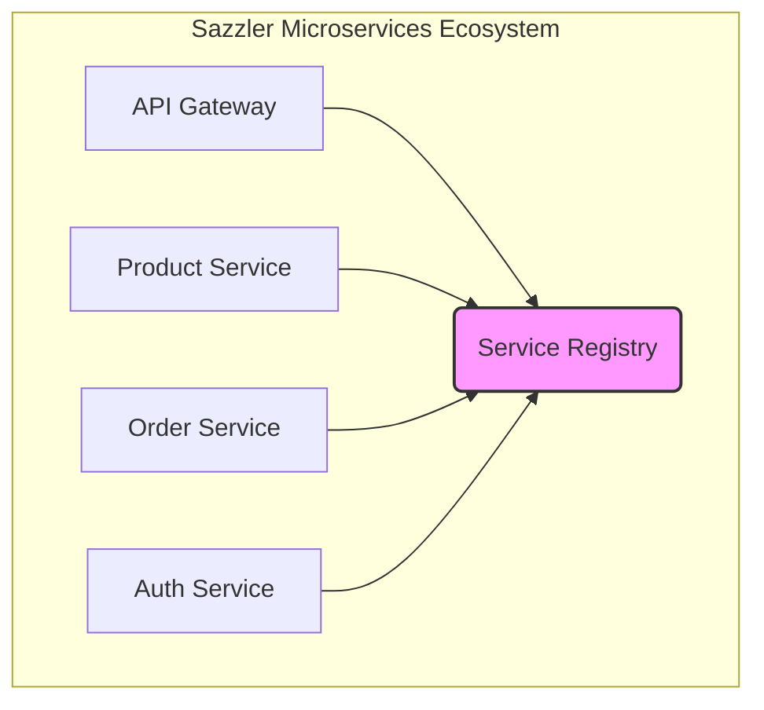

# Sazzler Service Registry (Eureka)

## 1. Overview
This project implements the **Sazzler Service Registry** using Spring Cloud Netflix Eureka. In our microservices architecture, this registry is the central hub where all other microservices register themselves. This allows for dynamic service discovery, load balancing, and resilience.

The registry maintains a dynamic list of available service instances, enabling services to locate and communicate with each other without hardcoding hostnames and ports.

## 2. Architecture

### 2.1. Role in the Ecosystem
The Service Registry is a foundational component. All other microservices are Eureka clients that register with this server.



### 2.2. Service Registration Flow
1.  A microservice (e.g., Product Service) starts up.
2.  It sends a registration request to the Eureka server with its metadata (name, IP, port).
3.  The Eureka server adds the instance to its registry.
4.  The service instance sends periodic heartbeats to the server to renew its lease.
5.  If heartbeats stop, the server removes the instance after a timeout.

## 3. Features
- **Service Registration:** Allows microservices to register themselves.
- **Service Discovery:** Enables services to discover the locations of other services.
- **Eureka Dashboard:** Provides a UI to view registered instances and their health status.
- **Health Checks:** Monitors the health of registered services.
- **High Availability:** Can be run in a clustered mode for resilience (peer awareness).

## 4. Setup and Configuration

### 4.1. Prerequisites
- Java 21+
- Gradle 8.x+

### 4.2. Build & Run
```bash
# Build the project
./gradlew build

# Run the application
./gradlew bootRun
```
The server will start on port `8761` by default.

### 4.3. Configuration (`application.yaml`)
Key configuration properties:

```yaml
server:
  port: 8761

spring:
  application:
    name: sazzler-service-registry

# Configuration for Eureka Server
eureka:
  client:
    # A standalone server should not register with itself
    register-with-eureka: false
    # A standalone server does not need to fetch registry information
    fetch-registry: false
    service-url:
      # The URL where other services will register
      defaultZone: http://localhost:8761/eureka/
  server:
    # Time to wait for heartbeats before evicting an instance
    eviction-interval-timer-in-ms: 5000
    # Wait time for a single instance to re-register before evicting
    wait-time-in-ms-when-sync-empty: 0

# Optional: Secure the Eureka dashboard
# spring.security.user:
#   name: your-username
#   password: your-password
```

## 5. Usage

### 5.1. Accessing the Dashboard
Once the server is running, you can access the Eureka dashboard in your browser:
**URL:** `http://localhost:8761/`

The dashboard shows all registered services, their instance details, and current status.

### 5.2. Client Configuration
For other microservices to register with this server, they need the following configuration in their `application.yaml`:

```yaml
eureka:
  client:
    service-url:
      defaultZone: http://localhost:8761/eureka/
```

## 6. Docker

### 6.1. Build Docker Image
```bash
docker build -t sazzler-service-registry .
```

### 6.2. Run Docker Container
```bash
docker run -p 8761:8761 sazzler-service-registry
```

## 7. Troubleshooting
- **Port 8761 is already in use:** Stop the process using the port or change the `server.port` in `application.yaml`.
- **Services not registering:**
    - Ensure the client's `eureka.client.service-url.defaultZone` points to the correct Eureka server address.
    - Check for network connectivity issues between the client and the server.
- **Dashboard not accessible:**
    - Verify the server is running.
    - If security is enabled, ensure you are using the correct credentials.
